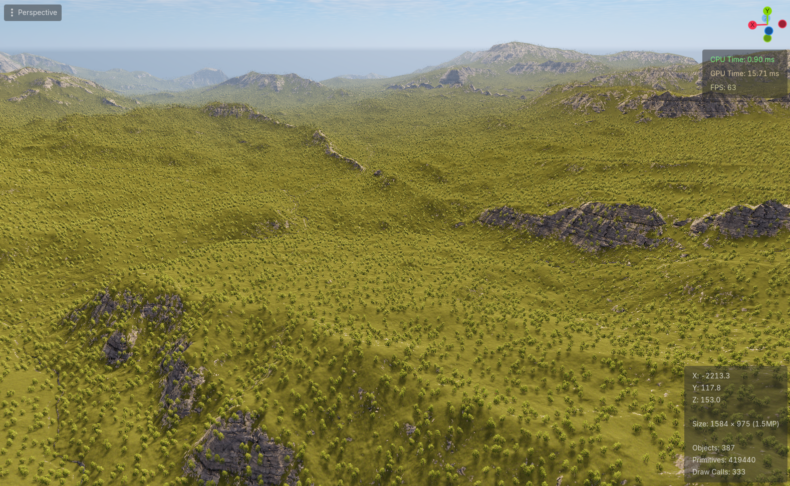
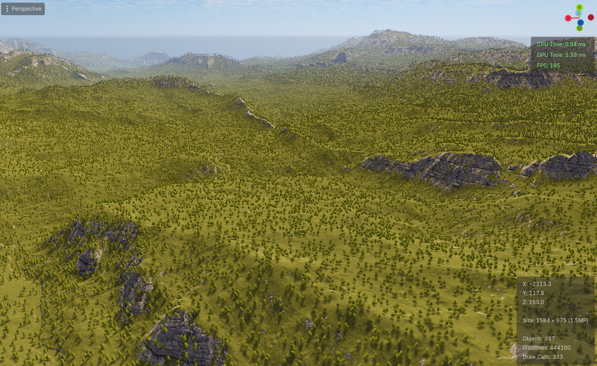
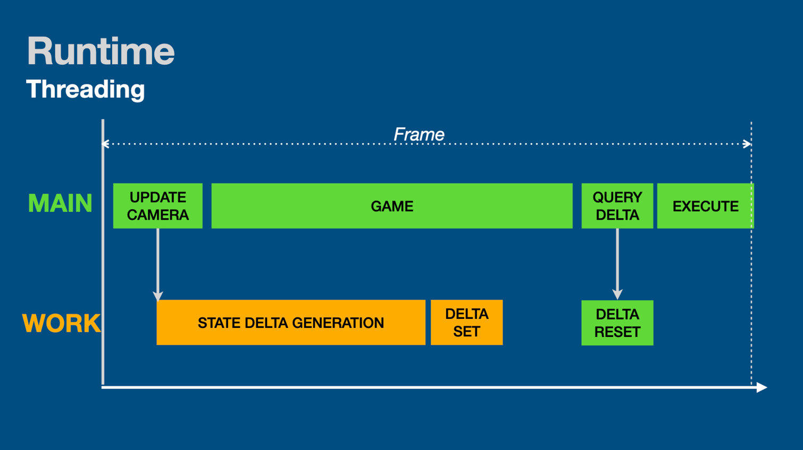
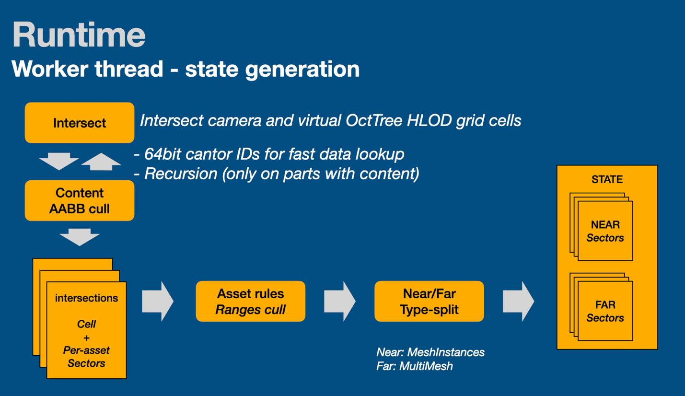
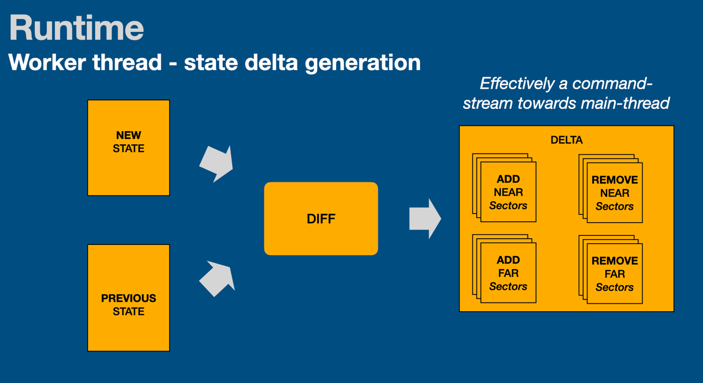
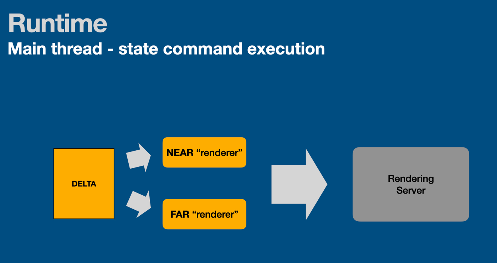
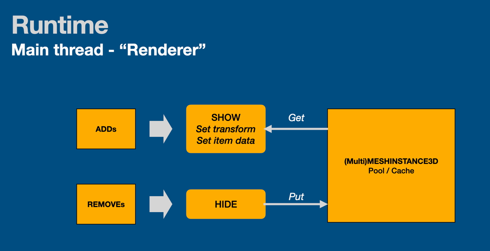

# TreesDemo
Scene using Voxel LODs:

Same scene using Octahedral projected billboards (cards)

Demo of rendering large amount of simple trees in Godot (playback only, no authoring tools)

This is (part of) the code used for the GodotCon Amsterdam 2026 talk "The long road to a million trees".
Note that to allow for better observation this demo uses a reduced number of trees (500k instead of 2 million).

The authoring tools for the Composite / VoxelLOD's is not included as they are in a 'developer-state'.

The scene runs in-editor. If running the project, make sure to select a empty 3D scene, otherwise performance will lag, and issues with big stutters arise when switching modes (this is due to the configuration being a shared resource, and both editor and running instance will process the Composite simultaneously, causing major lock stalls).

Switching between VoxelLODs and octahedral projected billboards ('Cards'):
- in editor, switch by changing 'use cards' in the inspector on the Runtime node.
- when running, press TAB

As a TL;DR conclusion of this fun and educational project, cards perform better, and are more temporally stable in the far distance. As such, I'd recommend not persuing the voxel approach, except for maybe some edge use cases.

Other notes:

1. A 'gotcha' is that Godots build in script profiler does not discern between main and worker threads (im condidering adding a proposal for that to Godot).
2. This does not include colliders (although could be done with simmilar approach)
3. If this script-only method is used with > 3 assets mixed (and high volume/density of trees); due to iteration counts, MAIN thread CPU use *will* go up significantly (GPU is fine though); As such, the overall setup works, but would need a native implementation to be useful.
4. Note the prefix of everything with 'Godite' at the time, YES i was being cheeky... 

How it works in a nutshell:

1. Data in octree, Frustum intersection (not 'just' frustum culling, but the cull result also directs *the way* items are draw technically)
3. MultiMeshInstance buffers are swapped (so not all 5 layers of the octree need to be on the GPU, which would be the case if doing the same thing using Godots build-in HLOD function; that would also take million+ nodes and forever to load etc.)
4. Option for merging/'baking' distance cells (reducing draw calls, but this is not very noticable in this demo scene with just 2 asset-types). Since voxels use vertex color and no texture, things can easily be combined. Obviously does not work in card mode.
5. Option for condensing (which boils down to removing some items in the distance, reducing draw time/overdraw/jitter); works for both voxel and card mode.
6. Closeby cells (proximity cells) are converted to MeshInstance3Ds; with a LOD crossfade to their Faux counterpart

